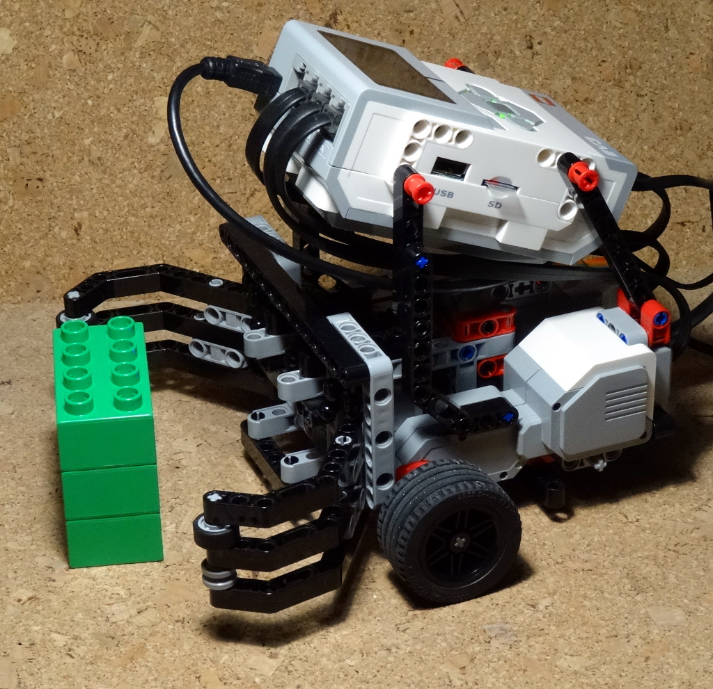

`ev3dev.contrib.navigation` demonstrations
==========================================

pilot-diff.py
-------------

Basic moves of a differential robot, using the :py:class:`ev3dev.contrib.navigation.DifferentialPilot` class.

