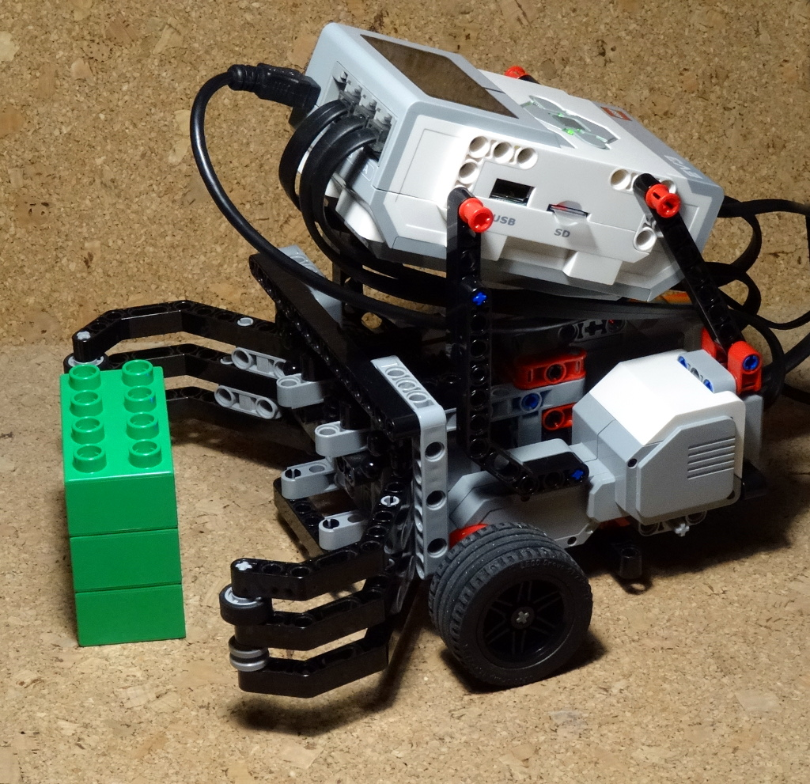

`ev3dev.robotics` demonstrations
================================

pilot-diff.py
-------------

.. deprecated:: replaced by :py:mod:`ev3dev.robotics.chassis`

Basic moves of a differential robot, using the :py:class:`ev3dev.robotics.navigation.DifferentialPilot` class.

chassis-diff.py
---------------

The same demo as `pilot-diff`, but using the new :py:class:`ev3dev.robotics.chassis.DifferentialWheeledChassis` class.
